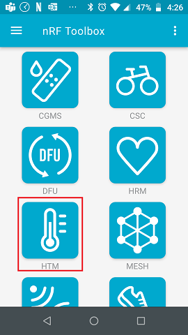
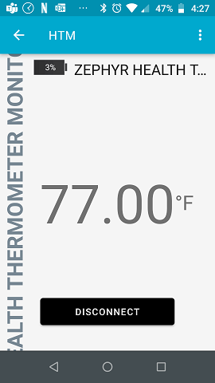

# How to map LED0 GPIO to the BL654 Dongle's (451-00004) LED

Currently, the BL654 dongle (Part Number: 451-00004) does not have its own Zephyr board files. However, with some minor modifications, we can use Nordic Semiconductor's nrf52840 dongle board files with the BL654 dongle.

In this tutorial, we will show you how to modify the devicetree from the nrf52840 dongle board files, so that the correct GPIO is mapped to the BL654 dongle's LED. We will then build the Blinky sample app and flash it into the BL654 dongle.

If you are not familiar with device trees, please refer to [Zephyr Devicetree](https://docs.zephyrproject.org/latest/guides/dts/index.html).


1. Prerequisites

   - You followed our [Zephyr Getting Started Guide](ubuntu.md) on how to setup the Zephyr development environment (i.e. Steps 1 - 5).

   - Install nRFutil

     ```
     pip3 install nrfutil
     ```

     nRFutil is a command-line utility that supports Device Firmware Updates (DFU). We will use it to generate a firmware update package and flash the package into the dongle.

     

2. Modify the device tree

   There are 2 required changes:

   - Map the correct GPIO to the BL654 dongle's LED. BL654 uses GPIO13.
   - Change the pin configuration so that it's active high

   

   Open ~/zephyrproject/zephyr/boards/arm/nrf52840dongle_nrf52840/nrf52840dongle_nrf52840.dts with a text editor and modify the device tree as shown below.

   

   Original:

   ```
   	leds {
   		compatible = "gpio-leds";
   		led0_green: led_0 {
   			gpios = <&gpio0 6 GPIO_ACTIVE_LOW>;
   			label = "Green LED 0";
   		};
   		.
   		.
   		.
   ```

   

   Modified:

   	leds {
   		compatible = "gpio-leds";
   		led0_green: led_0 {
   			gpios = <&gpio0 13 GPIO_ACTIVE_HIGH>;
   			label = "Green LED 0";
   		};
   		.
   		.
   		.	
   

3. Build Blinky

   ```
cd ~/zephyrproject/zephyr
   west build -p auto -b nrf52840dongle_nrf52840 samples/basic/blinky 
```
   
 
   
4. Create DFU package

   ```
nrfutil pkg generate --hw-version 52 --application build/zephyr/zephyr.hex --application-version 1 --sd-req 0x00 blinky.zip 
   ```
   
   


5. Flash the update package into the dongle

   - Connect dongle to the PC

     Make sure the dongle is in bootloader mode, by pressing the reset button on the dongle. If in bootloader mode, you should  see the LED fade in and out slowly.

     

   - On terminal type *dmesg*

   - Flash the build

     ```
     nrfutil dfu serial -pkg blinky.zip -p /dev/ttyACM0 
     ```
   ```
     
   After flashing, the module should automatically go into advertising mode.
     
     
   ```

6. Connect to the module using nRF Toolbox

   - Launch nRFToolbox and then click HTM icon

     

     

   - Click connect 

     

     

   - Select the Zephyr Health Thermometer device

     

   - Temp shown

     

     

   

