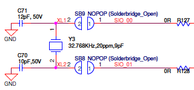

# Enabling the 32kHz Crystal on the BL65x Dev Kit

For designs that require the least amount of current consumption, it's recommended that you use an external +/- 20ppm 32.768kHz crystal. Laird's BL65x dev kit comes with the 32.768kHz crystal. However, the default setting is not connected. This tutorial will show you how to connect the 32.768 kHz and  build the Health Thermometer sample app so that it works with the 32kHz crystal connected.

**Prerequisites:**

- You have followed our [Getting Started Guide](ubuntu.md).

- Install nRF Toolbox into an Android or iOS device.

Steps

1. Connect the 32.768kHz Crystal

   - Unsolder R127 and R128 from the dev kit

   - Short Solder Bridge SB8 and SB9

     

     

2. Modify the bl65x_dvk_defconfig file

   For

   `\# 32kHz clock source 

   \# CONFIG_CLOCK_CONTROL_NRF_K32SRC_RC=y 

   \# CONFIG_CLOCK_CONTROL_NRF_K32SRC_500PPM=y `

3. 

4. Modify the ~/zephyrproject/zephyr/boards/arm/

