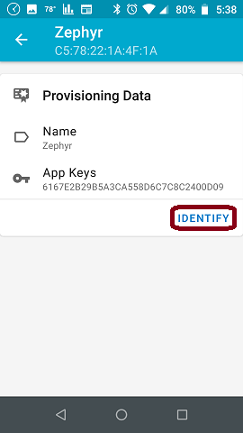
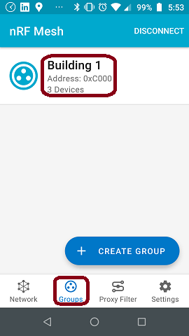

# Getting Started with Mesh

This tutorial will demonstrate how to bring up a Generic OnOff Model Server on a BL65x dev kit (i.e. LED1 on the dev kit will be turned on/off). We will provision 3 nodes into the network. All 3 nodes will be configured as Generic OnOff Model Servers. All 3 nodes will also subscribe to a same group; so that LED1 on all nodes can be toggled on/off at the same time.

The goal of this tutorial is to give you a simple example that can get you started on mesh right away. For a deeper dive into Bluetooth Mesh,  refer to the [Bluetooth Mesh Developer Study Guide](https://www.bluetooth.com/blog/bluetooth-mesh-developer-study-guide-v2-0/). 


1. Prerequisites

   - You have followed our [Zephyr Getting Started Guide](ubuntu.md).

   - Install [nRF Mesh](https://www.nordicsemi.com/Software-and-tools/Development-Tools/nRF-Mesh) into an Android or iOS device. This will be used to provision the nodes and to turn on/off LED1 on the dev kit

   - You have 3 BL65x dev kits. For this demo, we will use a BL562 (node1), BL653 (node2) and BL654 (node3).

     

2. Setup

   

3. Build the Mesh Sample app

   1. Replace main.c from ../samples/bluetooth/mesh/src/main.c with this [main.c](../src/mesh/main.c)

      This replacement main.c is basically the original main.c with the following modifications:

      - Added code to control LED1 of the dev kit. Code is based on the Blinky example

      - Added UUID. NOTE: We will program each node with a different UUID

      - Added code to handle an unacknowledged on/off message
      - Enabled relay function

      It's recommend that you make a backup of the original main.c; so that you can diff it against the replacement main.c. This will allow you to easily see the changes that were done.

   2. Open main.c with a text editor and confirm that the UUID is set for node 1

      ```c
      static const uint8_t dev_uuid[16] = { 0x00, 0x01, 0x02, 0x03, 0x04, 0x05, 0x06, 0x07, 0x08,0x09, 0x0A, 0x0B, 0x0C, 0x0D, 0x0E, 0x01 }; //use for node 1
      //static const uint8_t dev_uuid[16] = { 0x00, 0x01, 0x02, 0x03, 0x04, 0x05, 0x06, 0x07, 0x08,0x09, 0x0A, 0x0B, 0x0C, 0x0D, 0x0E, 0x02 }; //use for node 2
      //static const uint8_t dev_uuid[16] = { 0x00, 0x01, 0x02, 0x03, 0x04, 0x05, 0x06, 0x07, 0x08,0x09, 0x0A, 0x0B, 0x0C, 0x0D, 0x0E, 0x03 }; //use for node 3
      ```

      

   3. Build and flash node 1

      For this demo we will use the BL652 for node 1

      - To build for BL652:

        ```
        cd ~/zephyrproject/zephyr
        west build -p auto -b bl652_dvk samples/bluetooth/mesh 
        ```

      - To flash

        ```
        west flash
        ```

        

   4. Build and flash for node 2

      For this demo will use the BL653 for node 2

      - Modify main.c to use the node 2 UUID

        ```c
        //static const uint8_t dev_uuid[16] = { 0x00, 0x01, 0x02, 0x03, 0x04, 0x05, 0x06, 0x07, 0x08,0x09, 0x0A, 0x0B, 0x0C, 0x0D, 0x0E, 0x01 }; //use for node 1
        static const uint8_t dev_uuid[16] = { 0x00, 0x01, 0x02, 0x03, 0x04, 0x05, 0x06, 0x07, 0x08,0x09, 0x0A, 0x0B, 0x0C, 0x0D, 0x0E, 0x02 }; //use for node 2
        //static const uint8_t dev_uuid[16] = { 0x00, 0x01, 0x02, 0x03, 0x04, 0x05, 0x06, 0x07, 0x08,0x09, 0x0A, 0x0B, 0x0C, 0x0D, 0x0E, 0x03 }; //use for node 3
        ```

        

      - To build for BL653

        ```
        cd ~/zephyrproject/zephyr
        west build -p auto -b bl653_dvk samples/bluetooth/mesh 
        ```

      - To flash

        ```
        west flash
        ```

   5. Build and flash for node 3

      For this demo will use the BL654 for node 3

      - Modify main.c to use the node 3 UUID

        ```c
        //static const uint8_t dev_uuid[16] = { 0x00, 0x01, 0x02, 0x03, 0x04, 0x05, 0x06, 0x07, 0x08,0x09, 0x0A, 0x0B, 0x0C, 0x0D, 0x0E, 0x01 }; //use for node 1
        //static const uint8_t dev_uuid[16] = { 0x00, 0x01, 0x02, 0x03, 0x04, 0x05, 0x06, 0x07, 0x08,0x09, 0x0A, 0x0B, 0x0C, 0x0D, 0x0E, 0x02 }; //use for node 2
        static const uint8_t dev_uuid[16] = { 0x00, 0x01, 0x02, 0x03, 0x04, 0x05, 0x06, 0x07, 0x08,0x09, 0x0A, 0x0B, 0x0C, 0x0D, 0x0E, 0x03 }; //use for node 3
        ```

        

      - To build for BL654

        ```
        cd ~/zephyrproject/zephyr
        west build -p auto -b bl654_dvk samples/bluetooth/mesh 
        ```

      - To flash

        ```
        nrfjprog -f nrf52 --eraseall
        west flash
        ```

   

4. Provision nodes, enable Generic On Off Model  and setup a Subscription

   - Power up all 3 nodes
   
   - Optional: If you are powering the dev kit via the USB1 port, you can monitor debug messages (e.g. See TTL count as message hop from node to node) with a terminal emulator (e.g. Tera Term) set to 115200, N, 8, 1. 
   
   - Launch the nRF Mesh and then click "ADD NODE". You should see the 3 nodes as shown below. To provision, click one of the nodes.
   
     
   
     
   
   - Next click "IDENTIFY"
   
     
   
     
   
   - Next click "PROVISION"
   
     
   
     
   
   - Select "No OOB" and then click "OK"
   
     
   
     
   
   - Provision complete, click "OK"
   
     
   
     
   
   - Next click the provisioned node
   
     
   
     
   
   - Click node name to rename. We will change it from "Zephyr" to "BL653".
   
     
   
     
   
     
   
     
	
     
   
     
	
   - Next expand "Elements" pull down menu
   
     
	
     
   
   - Click "Generic On Off Server"
   
     
   
     
   
   - Click "BIND KEY"
   
     
   
     
   
   - Click "Application Key 1"
   
     
   
     
   
   - Bound App Key shown below
   
     
   
     
   
   - Next setup subscription, by clicking "SUBSCRIBE". We will create and subscribe to a group called "Building 1". This group will be used to turn LED1 on/off on all 3 nodes.
   
     
   
     
   
     
   
     
   
   - BL653 node is now fully configured and is shown below. Next click "ADD NODE" and repeat above steps to provision and configure the other 2 nodes.
   
     
   
     
   
   - After provisioning all 3 nodes, navigate to the home screen of nRF Mesh and select "Groups" and then click "Building 1". NOTE: nRF Mesh app must be connected to one of the nodes.
   
     
   
     
   
   - Toggle LEDs on/off by clicking "ON" or "OFF"
   
     
   
     
